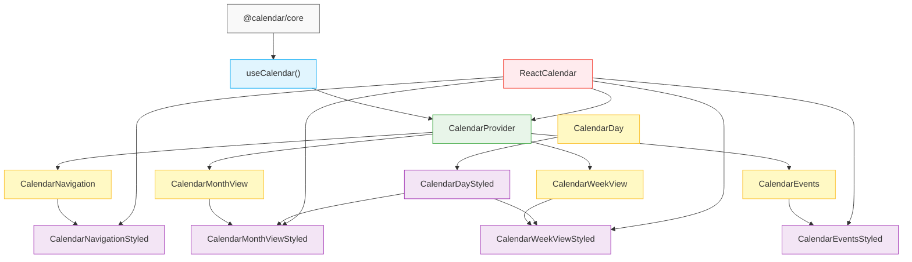
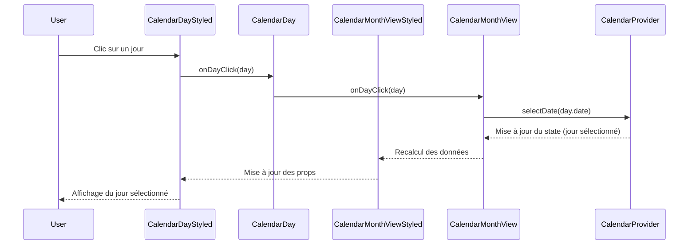

# Architecture de @calendar/react

Ce document explique l'architecture headless/styled de @calendar/react et comment les différents composants interagissent entre eux.

## Pattern Headless/Styled

@calendar/react est basée sur le pattern headless/styled, qui consiste à séparer clairement la logique et la présentation :

### Composants Headless

Les composants headless sont responsables uniquement de la logique et des données. Ils :

- Utilisent `useCalendarContext()` pour accéder aux données du contexte
- Fournissent des fonctions de rendu personnalisables (`renderDay`, `renderGrid`, etc.)
- N'appliquent aucun style par défaut (sauf des styles de base pour le positionnement)
- Gèrent la logique de formatage des données (comme le format des noms de jours)

### Composants Styled

Les composants styled sont responsables uniquement de la présentation. Ils :

- Utilisent les composants headless pour obtenir la logique et les données
- Définissent l'apparence visuelle (CSS, styles)
- Implémentent les éléments d'interface utilisateur (boutons, grilles, etc.)
- Transmettent les props de configuration aux composants headless sans les modifier

## Diagramme des composants

Voici un diagramme qui illustre les relations entre les différents composants :



## Flux de données

Le flux de données dans @calendar/react suit un modèle unidirectionnel :

1. Le `CalendarProvider` initialise l'état global avec `useCalendar()`
2. Les composants headless accèdent à cet état via `useCalendarContext()`
3. Les composants headless transmettent les données et callbacks aux fonctions de rendu
4. Les composants styled utilisent ces renderers pour afficher l'interface utilisateur
5. Les interactions utilisateur déclenchent des callbacks qui mettent à jour l'état global
6. Le changement d'état provoque le re-rendu des composants concernés

Voici un exemple de flux pour un clic sur un jour :



## Gestion des props

Les props suivent un flux précis dans l'architecture :

### Hiérarchie des props de configuration

1. **CalendarProvider** : Définit les valeurs par défaut globales
2. **Composants headless** : Peuvent remplacer ces valeurs par défaut
3. **Composants styled** : Transmettent les valeurs aux composants headless

Par exemple, pour `dayNameFormat` :

```tsx
// Le CalendarProvider définit une valeur par défaut
<CalendarProvider dayNameFormat="short">
  {/* ... */}
</CalendarProvider>

// Le composant headless peut utiliser cette valeur ou la remplacer
function CalendarMonthView({ dayNameFormat }) {
  const { dayNames, dayNameFormat: contextFormat } = useCalendarContext();
  
  // Priorité : prop du composant > valeur du contexte
  const format = dayNameFormat || contextFormat;
  // Utilisation pour formatter les données...
}

// Le composant styled transmet simplement la prop
function CalendarMonthViewStyled({ dayNameFormat }) {
  return (
    <CalendarMonthView
      dayNameFormat={dayNameFormat}
      // Autres props de style...
    />
  );
}
```

## Personnalisation

@calendar/react offre plusieurs niveaux de personnalisation :

1. **Utilisation des composants styled** : Le moyen le plus simple, avec des props pour personnaliser l'apparence
   ```tsx
   <CalendarMonthViewStyled daySize="large" selectionStyle="fill" />
   ```

2. **Utilisation des composants headless avec vos propres renderers** : Pour un contrôle total sur l'apparence
   ```tsx
   <CalendarMonthView
     renderDay={({ day }) => <MyCustomDayComponent day={day} />}
   />
   ```

3. **Création de vos propres composants styled** : Pour réutiliser votre propre design system
   ```tsx
   function MyCustomCalendarMonthView(props) {
     return (
       <CalendarMonthView
         {...props}
         renderDay={/* votre renderer personnalisé */}
       />
     );
   }
   ```

4. **Création d'un calendrier entièrement personnalisé** : En utilisant directement le contexte et les hooks
   ```tsx
   function MyCompletelyCustomCalendar() {
     const calendar = useCalendarContext();
     // Implémentation entièrement personnalisée...
   }
   ```

## Principes de design

L'architecture de @calendar/react est basée sur les principes suivants :

1. **Séparation des préoccupations** : La logique et la présentation sont séparées
2. **Inversion de contrôle** : Les composants délèguent le rendu via des fonctions
3. **Composition** : Les composants peuvent être assemblés de différentes manières
4. **Flexibilité** : Plusieurs niveaux de personnalisation sont disponibles
5. **Cohérence** : Les interfaces des composants suivent des patterns similaires 