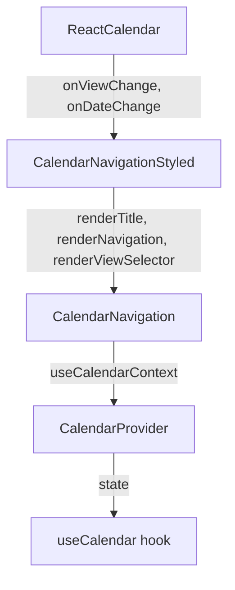

# Architecture des composants d'exemple

Ce dossier contient les composants d'exemple qui implémentent les composants headless avec des styles prédéfinis.

## Structure générale

L'architecture suit le pattern "headless components" avec trois niveaux :

1. **Composants Headless** (`../components/`)
   - Fournissent la logique et la structure
   - Ne contiennent pas de styles
   - Exemple : `CalendarNavigation`

2. **Composants Styled** (`./`)
   - Implémentent les styles
   - Utilisent les composants headless
   - Exemple : `CalendarNavigationStyled`

3. **Composant Final** (`./`)
   - Assemble les composants styled
   - Exemple : `ReactCalendar`

## Flux de données

Les composants styled utilisent les composants headless en passant uniquement les callbacks nécessaires :

```tsx
// Composant styled qui utilise le composant headless
<CalendarNavigationStyled 
  onViewChange={onViewChange}
  onDateChange={onDateChange}
/>
```

## Architecture et avantages

1. **Séparation des responsabilités**
   - Le composant headless (`CalendarNavigation`) gère toute la logique
   - Le composant styled (`CalendarNavigationStyled`) gère uniquement le style
   - Le composant final (`ReactCalendar`) assemble les pièces

2. **Gestion des données via contexte**
   - Le composant headless utilise le contexte (`useCalendarContext`)
   - Les données sont accessibles via le contexte plutôt que via les props
   - Seuls les callbacks sont passés en props

3. **Meilleure réutilisabilité**
   - Le même composant headless peut être utilisé avec différents styles
   - Les styles peuvent être modifiés sans toucher à la logique
   - La logique peut être modifiée sans toucher aux styles

## Flux de données



1. `ReactCalendar` passe les callbacks au composant styled
2. Le composant styled implémente le style et utilise le composant headless
3. Le composant headless utilise le contexte pour accéder aux données
4. Les callbacks sont propagés pour notifier les changements

## Bonnes pratiques

1. **Composants Headless**
   - Ne jamais inclure de styles
   - Utiliser le contexte pour les données
   - Fournir des props de rendu personnalisé

2. **Composants Styled**
   - Implémenter uniquement le style
   - Utiliser les composants headless
   - Minimiser les props nécessaires

3. **Composant Final**
   - Assembler les composants styled
   - Gérer les callbacks globaux
   - Fournir une API simple

## Exemple d'utilisation

```tsx
// Utilisation simple
<ReactCalendar />

// Utilisation avec callbacks
<ReactCalendar
  onViewChange={(view) => console.log('Vue changée:', view)}
  onDateChange={(date) => console.log('Date changée:', date)}
/>

// Utilisation avec personnalisation
<CalendarNavigationStyled
  className="custom-navigation"
  onViewChange={handleViewChange}
  onDateChange={handleDateChange}
/>
``` 