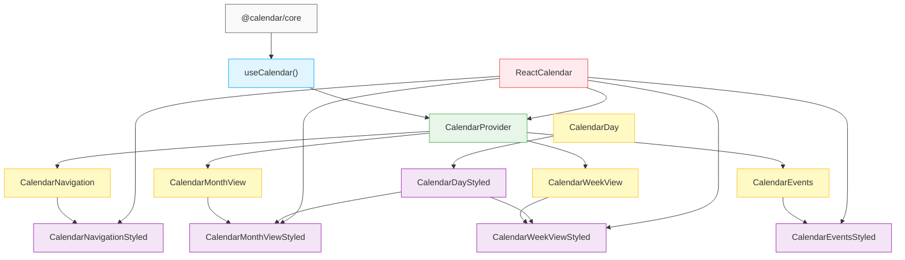
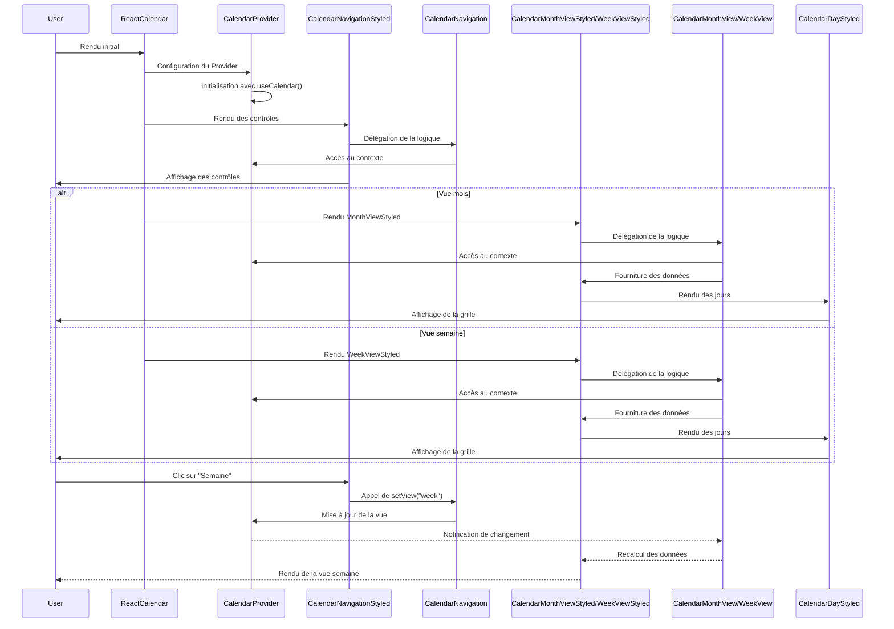

# Architecture des composants Calendar

Ce dossier contient les composants d'exemple qui implémentent les composants headless avec des styles prédéfinis.

## Diagramme des composants

Le diagramme suivant illustre les relations entre les différents composants :



## Structure générale et flux de données

L'architecture suit le pattern "headless components" avec une séparation claire entre logique et présentation :

### 1. CalendarProvider et Context (Source de vérité unique)

Le `CalendarProvider` est le cœur du système :
- Il utilise le hook `useCalendar` pour gérer l'état global
- Il expose cet état via un contexte React (`useCalendarContext`)
- Il fournit les fonctions pour modifier cet état (changer de vue, ajouter des événements, etc.)

```tsx
<CalendarProvider>
  {/* Composants enfants qui ont accès au contexte */}
</CalendarProvider>
```

### 2. Composants Headless (Logique pure)

Les composants headless sont responsables de la logique. Ils :
- Utilisent `useCalendarContext()` pour accéder aux données du contexte
- Fournissent les callbacks et fonctions pour interagir avec ces données
- Ne contiennent aucun élément d'interface utilisateur (UI)
- **Gèrent toute la logique de formatage des données** (comme le format des noms de jours)

Exemple simplifié :
```tsx
// Composant headless
function CalendarNavigation() {
  const { view, setView, goToNext } = useCalendarContext();
  
  // Retourne des données et fonctions, pas d'éléments UI
  return {
    currentView: view,
    changeView: setView,
    goToNextMonth: goToNext
  };
}
```

### 3. Composants Styled (Présentation)

Les composants styled s'occupent uniquement de l'apparence. Ils :
- Utilisent les composants headless pour obtenir données et callbacks
- Définissent l'apparence visuelle (CSS, styles)
- Implémentent les éléments d'interface utilisateur (boutons, titres, etc.)
- **Transmettent les props de configuration logique aux composants headless** sans traitement

Exemple simplifié :
```tsx
// Composant styled
function CalendarNavigationStyled() {
  // Utilise le composant headless pour obtenir données et callbacks
  return (
    <CalendarNavigation
      renderTitle={(date) => <h2>{formatDate(date)}</h2>}
      renderButtons={({ goToNextMonth }) => (
        <button onClick={goToNextMonth}>Mois suivant</button>
      )}
    />
  );
}
```

### 4. Composants d'assemblage (React-Calendar)

Le composant `ReactCalendar` assemble le tout :
1. Il configure le `CalendarProvider` avec les options initiales
2. Il organise les composants styled (navigation, vue mois/semaine, etc.)
3. Il gère le rendu conditionnel (afficher la vue mois ou semaine selon le contexte)

```tsx
function ReactCalendar({ onViewChange, ...props }) {
  return (
    <CalendarProvider onViewChange={onViewChange}>
      <CalendarContent />
    </CalendarProvider>
  );
}

// Composant interne qui accède au contexte
function CalendarContent() {
  const { view } = useCalendarContext();
  
  return (
    <div>
      <CalendarNavigationStyled />
      {view === 'month' && <CalendarMonthViewStyled />}
      {view === 'week' && <CalendarWeekViewStyled />}
    </div>
  );
}
```

## Comment les composants interagissent

Voici un aperçu détaillé des dépendances et flux de données :



## Le flux de données en action

Imaginons un utilisateur qui clique sur le bouton "Semaine" :

1. L'utilisateur clique sur le bouton dans `CalendarNavigationStyled`
2. Ce bouton appelle une fonction fournie par `CalendarNavigation` (le composant headless)
3. Cette fonction utilise `setView('week')` du contexte pour mettre à jour l'état
4. Le `CalendarProvider` met à jour sa valeur de `view` à `'week'`
5. Tous les composants qui utilisent `useCalendarContext()` sont notifiés
6. Le composant d'assemblage détecte que `view === 'week'` et affiche `CalendarWeekViewStyled`

Ce flux bidirectionnel permet une séparation claire des responsabilités :
- Les composants headless s'occupent de la logique et de l'état
- Les composants styled s'occupent de l'apparence
- Les composants d'assemblage s'occupent de l'organisation
- Aucun composant n'a besoin de connaître les détails internes des autres

## Gestion des props de configuration

Les props comme `dayNameFormat` suivent un flux précis à travers l'architecture :

### Hiérarchie des props de configuration

1. **CalendarProvider** : Définit les valeurs par défaut globales
2. **Composants headless** : Peuvent remplacer ces valeurs par défaut
3. **Composants styled** : Transmettent simplement les valeurs aux composants headless

Par exemple, pour le prop `dayNameFormat` :

```tsx
// 1. Le CalendarProvider définit une valeur par défaut
<CalendarProvider dayNameFormat="short">
  {/* ... */}
</CalendarProvider>

// 2. Le composant headless peut utiliser cette valeur ou la remplacer
function CalendarMonthView({ dayNameFormat }) {
  const { dayNames, dayNameFormat: contextFormat } = useCalendarContext();
  
  // Priorité : prop du composant > valeur du contexte
  const format = dayNameFormat || contextFormat;
  // Utilisation pour formatter les données...
}

// 3. Le composant styled transmet simplement la prop
function CalendarMonthViewStyled({ dayNameFormat }) {
  return (
    <CalendarMonthView
      dayNameFormat={dayNameFormat}
      // Autres props de style...
    />
  );
}
```

### Principes importants

- **Composants headless** : Responsables de la logique de traitement des props
- **Composants styled** : Ne modifient pas les données, seulement leur présentation
- **Props de configuration** : Définissent le comportement et le formatage des données
- **Props de style** : Définissent uniquement l'apparence visuelle

Cette séparation claire permet :
1. Une meilleure maintenabilité (on sait où la logique est traitée)
2. Plus de flexibilité (on peut changer la présentation sans toucher à la logique)
3. Une réutilisation facilitée (les composants headless peuvent être utilisés avec différents styles)

## Avantages de cette architecture

### 1. Séparation des responsabilités
- **Contexte** : Maintient l'état global et les fonctions de modification
- **Composants headless** : Gèrent la logique et l'interaction avec le contexte
- **Composants styled** : S'occupent uniquement de l'apparence
- **Composants d'assemblage** : Organisent et configurent

### 2. Flexibilité et personnalisation
- Vous pouvez changer l'apparence sans toucher à la logique
- Vous pouvez réutiliser la logique avec différentes présentations
- Vous pouvez remplacer des composants individuellement

### 3. Maintenance simplifiée
- Les bugs de logique et de présentation sont isolés
- Chaque composant a une responsabilité unique et claire
- Les tests sont plus simples à écrire

## Utilisation

### Utilisation simple
```tsx
<ReactCalendar />
```

### Utilisation avec callbacks
```tsx
<ReactCalendar
  onViewChange={(view) => console.log('Vue changée:', view)}
  onDateChange={(date) => console.log('Date changée:', date)}
  onDayClick={(day) => console.log('Jour cliqué:', day)}
/>
```

### Personnalisation avancée
```tsx
<CalendarProvider>
  <CalendarNavigationStyled className="custom-navigation" />
  <div className="custom-layout">
    <CalendarMonthViewStyled />
    <CalendarEventsStyled className="side-panel" />
  </div>
</CalendarProvider>
```